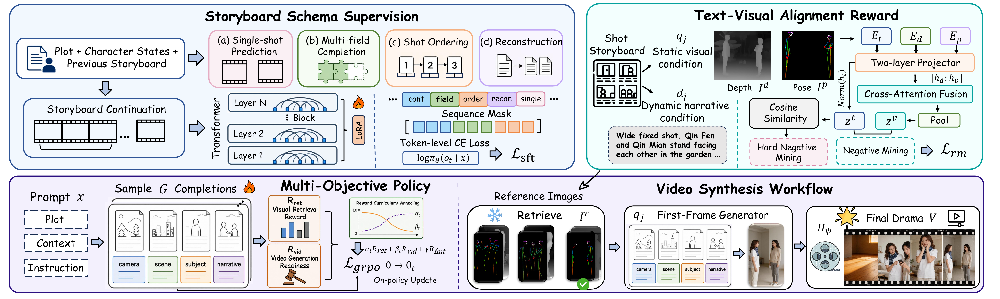

<div align="center">

# 🎬 DramaDirector

### Geometry-Guided Short Drama Generation with Storyboard Planning and Alignment Rewards ✨

<p>
  <a href="https://github.com/Hengji-cs/DramaDirector">
    
  </a>
  
  
  
</p>

<p>
  <a href="#framework">🏗️ Framework</a> |
  <a href="#installation">⚙️ Installation</a> |
  <a href="#preprocessing">🎞️ Preprocessing</a> |
  <a href="#training">🔥 Training</a> |
  <a href="#inference">🚀 Inference</a> |
  <a href="#video-generation">🎥 Video Generation</a>
</p>

<p>
DramaDirector is a research codebase for controllable short-drama generation.
It decomposes drama creation into storyboard planning, text-visual reward learning,
retrieval-aware policy optimization, first-frame generation, and downstream video synthesis.
</p>

</div>

---

### 🚨 Current Short-Drama Generation Challenges

- ❌ **Weak long-horizon consistency** - Characters, scenes, and story states can drift across shots.
- ❌ **Unstructured generation** - Plain text prompts often miss camera language, subject layout, dialogue, and duration.
- ❌ **Visual-narrative mismatch** - A shot may look plausible while failing to follow the intended plot beat.

### 💡 DramaDirector Solution

🎬 **DramaDirector** treats short-drama generation as a structured directing workflow: it first plans shot-level storyboards, then improves visual faithfulness with text-visual rewards, and finally packages the generated shots for first-frame and video synthesis. 🚀

---

<a id="news"></a>

## 📢 News

- Codebase organized around preprocessing, reward modeling, SFT, GRPO, and video generation.
- Released checkpoints include a reward model and a final RL LoRA adapter.
- The inference pipeline supports both standard Transformers/Unsloth generation and vLLM LoRA serving.

---

<a id="framework"></a>

## 🏗️ Framework

<div align="center">
  
  <p><em>DramaDirector combines storyboard schema supervision, text-visual alignment reward modeling, multi-objective policy optimization, retrieval, first-frame generation, and final video synthesis.</em></p>
</div>

---

<a id="repository-structure"></a>

## 📂 Repository Structure

```text
DramaDirector/
  preprocess/                 # Raw video processing, ASR, shot analysis, depth/pose assets, embeddings
  reward_model/               # Text-visual reward model, hard negative mining, grid search, training
  train/                      # Storyboard SFT and GRPO training
  generation/                 # Inference, prompt packaging, first-frame generation, video generation
  models/
    final_model_R10_0.0955.pt # Reward model checkpoint
    final_rl_lora/            # Final Qwen LoRA adapter after RL
  config.py                   # API keys and local data paths
  pyproject.toml              # Python dependencies managed by uv
```

---

<a id="installation"></a>

## ⚙️ Installation

We recommend using `uv` to create a reproducible Python environment.

```bash
uv sync
```

For vLLM inference, install the optional inference dependency group:

```bash
uv sync --extra inference
```

Main dependencies include `torch`, `transformers`, `trl`, `peft`, `unsloth`, `dashscope`, `openai`, `opencv-python`, and optional `vllm`.

---

<a id="configuration"></a>

## 🔐 Configuration

Before running preprocessing, retrieval, reward training, or video generation, edit `config.py`.

```python
DASHSCOPE_API_KEY = ""
DASHSCOPE_API_KEYS = []
RUNNINGHUB_API_KEY = ""

SAVED_DIR = PREPROCESS_ROOT / "saved"
PROCESSED_SPLIT_DIR = PREPROCESS_ROOT / "processed_split"
TEXT_EMB_DIR = PREPROCESS_ROOT / "text_emb"
DEPTH_EMB_DIR = PREPROCESS_ROOT / "depth_emb"
POSE_EMB_DIR = PREPROCESS_ROOT / "pose_emb"
EMB_BASE_DIR = PREPROCESS_ROOT
```

`DASHSCOPE_API_KEY` is used for plot analysis, embedding, retrieval checks, and reward-model text encoding.
`RUNNINGHUB_API_KEY` is used by the downstream RunningHub first-frame and video generation utilities.

---

<a id="preprocessing"></a>

## 🎞️ Preprocessing

The preprocessing pipeline converts raw drama episodes into structured data:

```text
raw video
  -> shot splitting and keyframes
  -> plot analysis
  -> ASR and transcript repair
  -> structured shot descriptions
  -> origin/depth/pose assets
  -> text/depth/pose embeddings
```

Recommended input layout:

```text
videos/
  drama_a/
    1.mp4
    2.mp4
  drama_b/
    1.mp4
```

Run from the `preprocess/` directory:

```bash
python extract_frames.py videos
python video_scene_analyzer.py videos
python transcribe.py saved
python fix_transcripts.py saved
python image_shot_analyzer.py saved
python check.py saved
python process_pipeline.py
python embed_texts.py
python embed_images.py
```

Or run the main chain:

```bash
bash prepare_dataset.sh
```

Depth and pose rendering require local copies of:

```bash
git clone https://github.com/DepthAnything/Depth-Anything-V2.git
git clone https://github.com/IDEA-Research/DWPose.git
```

Prepare the Depth-Anything-V2 checkpoint before running `process_pipeline.py`.
`extract_frames.py` also expects the local `shot_split` module used by `ShotSplitter`.
For ASR, `transcribe.py` is based on the external [Fun-ASR](https://github.com/FunAudioLLM/Fun-ASR) project; please follow the upstream project to prepare the ASR runtime and model resources when running this stage.

---

<a id="training"></a>

## 🔥 Training

### 🧩 Reward Model

The reward model learns text-visual alignment over storyboard text, depth representations, and pose representations.

```bash
uv run python reward_model/train.py
```

### 🧠 Supervised Fine-Tuning

```bash
uv run python train/sft.py
```

The SFT stage renders storyboard tasks and trains a LoRA policy over structured storyboard outputs.
This step is optional if you use the released LoRA checkpoint in `models/final_rl_lora/`.
For full SFT reproduction, the script expects `data/verl_storyboard_sft/train.parquet`, `data/verl_storyboard_sft/val.parquet`, and the internal rendering / short-task packing helpers used during training.

### 🚀 GRPO Optimization

```bash
uv run python train/rl_grpo_train.py \
  --nproc_per_node 2 \
  --base_model_dir ./Qwen/Qwen3-8B \
  --sft_checkpoint_dir outputs/verl_storyboard_sft/checkpoint-426 \
  --train_data_path data/verl_storyboard_sft/grpo_seq_continue/train.json \
  --val_data_path data/verl_storyboard_sft/grpo_seq_continue/val.json \
  --dashscope_api_key YOUR_DASHSCOPE_KEY \
  --judge_api_key YOUR_JUDGE_KEY \
  --output_dir rl_grpo_output \
  --num_train_epochs 2 \
  --per_device_train_batch_size 2 \
  --num_generations 4 \
  --max_completion_length 4096 \
  --learning_rate 5e-5
```

The GRPO reward combines:

```text
R = alpha * R_retrieval + beta * R_video_gen + gamma * R_format
```

- `R_retrieval`: visual retrieval alignment reward.
- `R_video_gen`: LLM-judged video generation readiness.
- `R_format`: JSON schema and field-completeness reward.

For GRPO reproduction, make sure the base model, SFT checkpoint, reward checkpoint, and GRPO JSON splits match your local paths before launch.

---

<a id="inference"></a>

## 🚀 Inference

The repository provides two inference paths:

- `generation/infer.py`: standard Transformers/Unsloth LoRA inference.
- `generation/infer_vllm.py`: vLLM batched LoRA inference.

Recommended LLM decoding parameters:

```text
temperature = 0.9
top_p = 0.9
repetition_penalty = 1.2
```

### ⚡ vLLM LoRA Inference

```bash
uv run python generation/infer_vllm.py \
  --checkpoint models/final_rl_lora \
  --base_model ./Qwen/Qwen3-8B \
  --test_file generation/test.json \
  --output_file infer_results.json \
  --temperature 0.9 \
  --top_p 0.9 \
  --repetition_penalty 1.2 \
  --max_new_tokens 8192 \
  --batch_size 8 \
  --tensor_parallel_size 1 \
  --gpu_memory_utilization 0.9 \
  --max_model_len 32768
```

### 🧪 Transformers/Unsloth Inference

```bash
uv run python generation/infer.py \
  --checkpoint models/final_rl_lora \
  --base_model ./Qwen/Qwen3-8B \
  --test_file generation/test.json \
  --output_file infer_results.json \
  --temperature 0.9 \
  --top_p 0.9 \
  --repetition_penalty 1.2 \
  --max_new_tokens 8192
```

The inference input file should contain a `user` field with plot summary, character list, and existing storyboard context.
The generated storyboard is saved as `model_output`.

---

<a id="video-generation"></a>

## 🎥 Video Generation

After inference, convert generated storyboard JSON into shot-level prompts:

```bash
uv run python generation/prepare_video_inputs.py \
  --input_glob "infer_results*.json" \
  --output_dir prepared_video_inputs
```

This exports prompt-oriented files under `prepared_video_inputs/storyboards/`, `prepared_video_inputs/video_inputs/`, and `prepared_video_inputs/prompt_text/`.

The first-frame generator expects a richer RunningHub input directory with shot controls and character prompts:

```text
prepared_data/
  shot_count_5/
    sample_xxx/
      sample_manifest.json
      characters/character_reference_prompts.json
      shots/shot_xxx/
        metadata.json
        prompt.txt
        controls/01_depth.png
        controls/02_pose.png
```

Once that directory is prepared, generate first frames:

```bash
uv run python generation/runninghub_image_generation.py \
  --data-root prepared_data \
  --output-root runninghub_outputs
```

Finally run image-to-video generation:

```bash
uv run python generation/run_runninghub2_video_generation.py \
  --assets-root runninghub_outputs \
  --prompt-source-template "prepared_video_inputs/video_inputs/infer_results" \
  --output-dir runninghub_video_generation_results
```

The complete generation flow is:

```text
plot + characters + previous storyboard
  -> storyboard continuation
  -> cleaned shot prompts
  -> first-frame generation
  -> video generation
  -> final drama clips
```

---

<a id="checkpoints"></a>

## 📦 Checkpoints

The current release expects:

```text
models/final_model_R10_0.0955.pt
models/final_rl_lora/
```

- `final_model_R10_0.0955.pt`: reward model checkpoint.
- `final_rl_lora/`: Qwen LoRA adapter trained for storyboard generation.

---

<a id="output-schema"></a>

## 🧾 Output Schema

DramaDirector generates a JSON array of shot objects. Each shot follows this schema:

```json
[
  {
    "index": 0,
    "shot_scale": "medium shot",
    "camera_angle": "eye-level",
    "camera_motion": "static",
    "subjects": [
      {
        "name": "character name",
        "gender": "gender",
        "clothing": "clothing description",
        "position": "position in frame",
        "action": "action description",
        "expression": "facial expression"
      }
    ],
    "background": "scene and environment",
    "description_narrative": "what happens in this shot",
    "dialogue": null,
    "speaker": null,
    "emotion": null,
    "duration": 2.5
  }
]
```

When an episode is complete, the model appends `<END>` after the JSON array.

---

<div align="center">

**🌟 If this project helps your research, please consider giving DramaDirector a Star!**

<p>
  <em>Thanks for visiting DramaDirector ✨</em>
</p>

</div>
